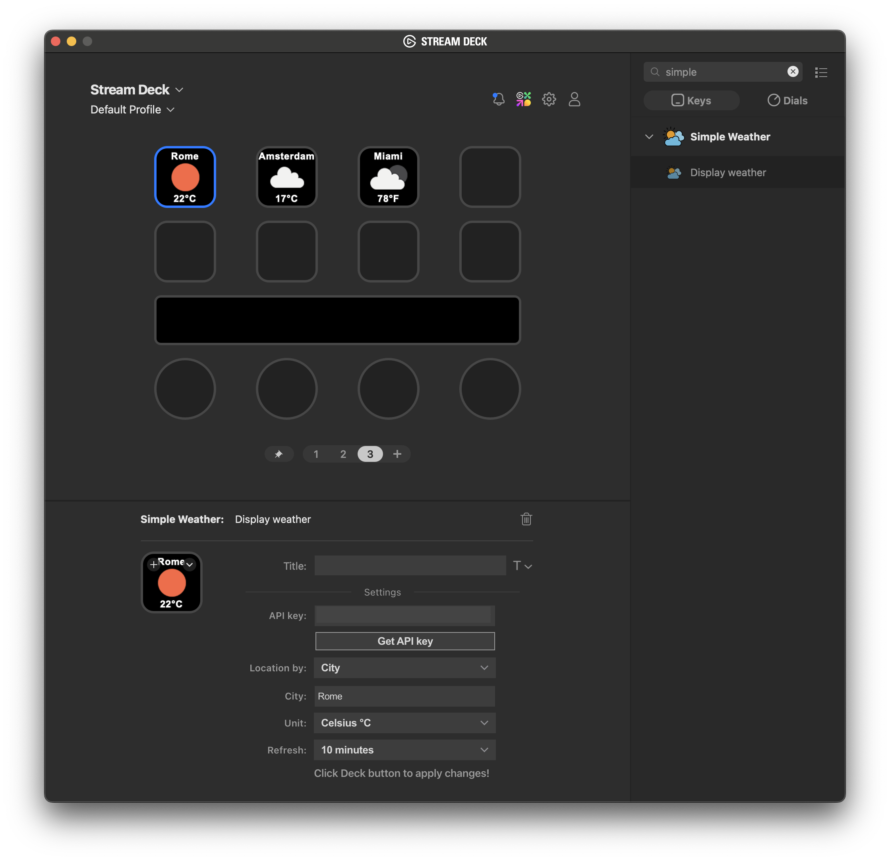

# Simple Weather plugin for Stream Deck

Stream Deck plugin to display weather conditions as a button in your Stream Deck, using the `OpenWeather` API.

Compatible with `windows` and `macOS`.

## Installation

- install the plugin file from the `relase` folder
- in your Stream Deck app, drag the `Simple Weather` button into an available slot
- fill in the button settings
- click the button to activate it

## Button Settings

- `API key`: your `OpenWeather` API key (get it [here](https://home.openweathermap.org/api_keys))
- `Location by`: how to configure the location, either by City or by Coordinates
- `City`: city for which to display the weather
- `Latitude`: latitude for which to display the weather (range: -90, 90)
- `Longitude`: longitude for which to display the weather (range: -180, 180)
- `Unit`: temperature unit (Celsius, Fahrenheit)
- `Refresh`: how often to refresh the data

## Packaging

### MacOS

```shell
./DistributionTool -b -i src/com.dariom.simple-weather.sdPlugin -o release
```

The generated plugin can be found in the `release` folder.

### Windows

Follow the instructions on the Stream Deck SDK [page](https://docs.elgato.com/sdk/plugins/packaging).

## Preview

